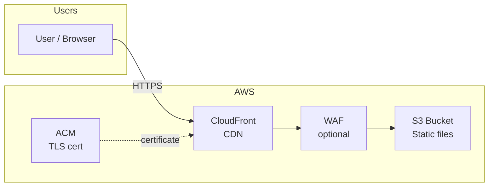
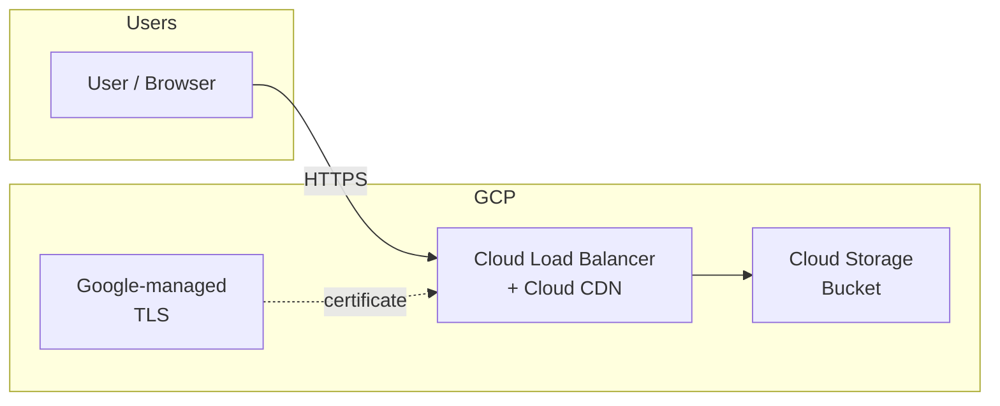
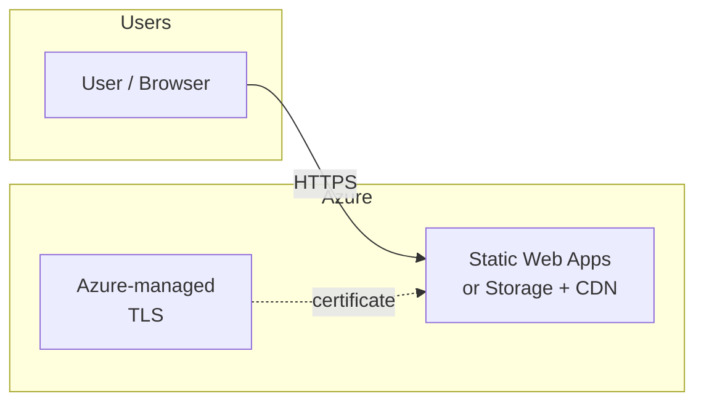
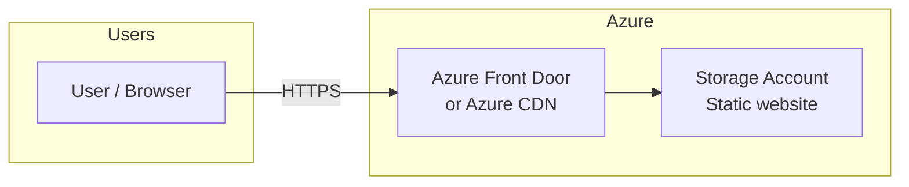

# Frontend architecture — AWS, GCP, Azure

The Nexus API company frontend is hosted on all three major clouds. Each platform uses its native static hosting and CDN. Same build artifact is deployed to each.

---

## 1. AWS architecture

### Diagram

### Components

| Component | Role | Justification |
|-----------|------|---------------|
| **S3** | Origin storage for static files (HTML, JS, CSS, assets). Bucket is private; only CloudFront can read. | Standard pattern for static sites on AWS; cheap, durable, and integrates with IAM and bucket policies for least-privilege access. |
| **CloudFront** | CDN and single public endpoint. Terminates TLS, caches at the edge, and serves from the nearest edge location. | Low latency globally; reduces load on S3; single place to attach WAF and custom domains. |
| **ACM (Certificate Manager)** | TLS certificate for the custom domain (e.g. `nexus.example.com`). | Free, managed certs; auto-renewal; required for HTTPS on CloudFront. |
| **WAF (optional)** | Web application firewall in front of CloudFront. | Aligns with security curriculum (network security, DDoS/OWASP rules); can be added when covering WAF and hardening. |

### Data flow

1. User requests `https://nexus-aws.example.com/` (or path).
2. DNS resolves to the CloudFront distribution.
3. CloudFront serves from cache if available; otherwise fetches from S3 (origin).
4. S3 returns the static file; CloudFront caches and responds to the user.

### Justification summary

- **Security:** Private S3, no direct public access; TLS and optional WAF at the edge; IAM and bucket policies for audit and access control.
- **Cost:** S3 + CloudFront is low cost for static traffic; pay per request and data transfer.
- **Training:** Matches common enterprise patterns; good for Blue Team (logging, WAF, IAM) and Red Team (testing edge and origin access).

---

## 2. GCP architecture

### Diagram

### Components

| Component | Role | Justification |
|-----------|------|---------------|
| **Cloud Storage (GCS)** | Origin for static files. Bucket can be configured as a static website or as a backend bucket for the load balancer. | Same idea as S3: durable, cheap, IAM and bucket policies; integrates with GCP security and audit logging. |
| **Cloud Load Balancer (HTTP(S)) + Cloud CDN** | Global HTTPS endpoint and CDN. LB terminates TLS and routes to the GCS bucket; Cloud CDN caches at the edge. | Single global anycast IP; CDN reduces latency and origin load; TLS is managed by Google. |
| **Google-managed TLS** | TLS certificate for the custom domain. | No extra cost; auto-provisioning and renewal when using the load balancer. |

### Alternative: Firebase Hosting

For a simpler setup (especially with Firebase Auth), you can use **Firebase Hosting** instead of GCS + LB + CDN: same static files, global CDN, and managed TLS. The diagram above reflects the “native GCP” option that parallels AWS (S3 + CloudFront) and Azure (Static Web Apps / Storage).

### Data flow

1. User requests `https://nexus-gcp.example.com/`.
2. Request hits the global HTTP(S) load balancer.
3. Cloud CDN serves from cache or fetches from the GCS backend bucket.
4. GCS returns the object; CDN caches and responds.

### Justification summary

- **Security:** IAM and bucket-level access; no public bucket if using LB as sole access path; VPC and Cloud Armor can be added for WAF/DDoS (curriculum alignment).
- **Cost:** GCS and Cloud CDN pricing is competitive; egress and requests are the main variables.
- **Training:** Mirrors AWS pattern (origin + CDN); good for comparing IAM, logging, and networking across clouds.

---

## 3. Azure architecture

### Diagram

### Option A: Azure Static Web Apps (recommended for simplicity)

| Component | Role | Justification |
|-----------|------|---------------|
| **Azure Static Web Apps** | Hosts the static frontend; provides global CDN, custom domain, and managed TLS. Integrated with GitHub Actions for deploy. | Minimal config; one resource for hosting + CDN + TLS; good for training and quick iteration. |
| **Azure-managed TLS** | TLS for custom domain. | Free and managed; no cert lifecycle to handle. |

### Option B: Storage account + Azure CDN (closer to AWS/GCP pattern)

| Component | Role | Justification |
|-----------|------|---------------|
| **Storage account (static website)** | Origin for static files. Static website option enables anonymous read for the site. | Parallels S3 and GCS; uses Azure RBAC and storage security; good for comparing access models. |
| **Azure Front Door or Azure CDN** | CDN and HTTPS endpoint; routes to the storage origin. | Edge caching and DDoS protection; Front Door can add WAF for curriculum alignment. |

### Data flow (Static Web Apps)

1. User requests `https://nexus-azure.example.com/`.
2. Request hits the Static Web Apps global endpoint (CDN-backed).
3. Cached content is served or fetched from the built-in origin.
4. Response returned to the user.

### Justification summary

- **Security:** Managed identity and RBAC; optional WAF with Front Door; logging and monitoring via Azure Monitor.
- **Cost:** Static Web Apps has a free tier; Storage + CDN is predictable for static content.
- **Training:** Completes the three-cloud picture; same mental model (origin + edge + TLS) with Azure-specific controls.

---

## Comparison summary

| Aspect | AWS | GCP | Azure |
|--------|-----|-----|--------|
| **Origin** | S3 bucket | Cloud Storage bucket | Static Web Apps or Storage account |
| **CDN / Edge** | CloudFront | Cloud CDN (via LB) | Built into Static Web Apps or Front Door / CDN |
| **TLS** | ACM | Google-managed | Azure-managed |
| **WAF** | AWS WAF (optional) | Cloud Armor (optional) | Front Door WAF (optional) |
| **Deploy** | Upload to S3; invalidate CloudFront | Upload to GCS; invalidate CDN | Git-integrated (Static Web Apps) or upload to Storage |

All three architectures follow the same high-level pattern: **static origin + edge CDN + managed TLS**, with optional WAF for security training. The same frontend build is deployed to each; only the hosting and deploy steps differ per cloud.
